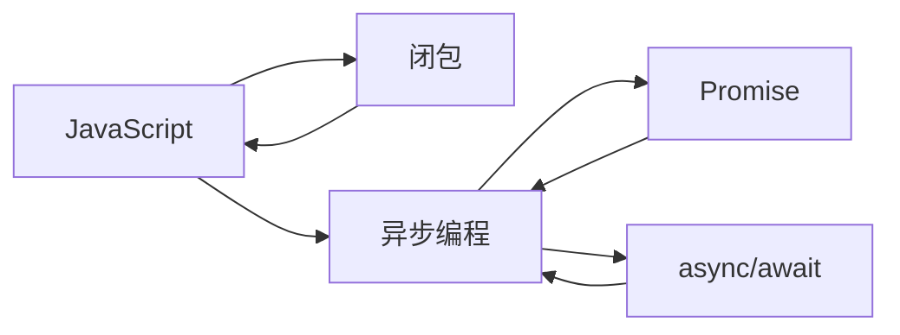

# 下载

直接在 [https://obsidian.md/download](https://obsidian.md/download) 然后本地安装。

# 快速体验

让我们用快速体会 Obsidian 的核心魅力——链接式笔记、双向连接和知识网络。

我们用一个小例子演示。

## 创建你的第一个笔记

打开 Obsidian，新建一个 Vault（知识库），比如叫 “我的知识库”。

新建一个笔记，叫 `JavaScript`，写一些内容：

```markdown
# JavaScript
JavaScript 是一种用于网页开发的编程语言。它可以操作 DOM、处理事件、以及与后端交互。
常见概念：
- 变量与常量
- 函数
- 闭包
- 异步编程
```

## 创建相关笔记并建立链接

新建笔记 `闭包`，写内容：

```markdown
# 闭包
闭包是指函数可以访问外部作用域的变量，即使外部函数已经执行完。
在 JavaScript 中非常常见。
```

现在回到 `JavaScript` 笔记里，写成：

```markdown
- 常见概念：
  - [[闭包]]
```

你会发现 `闭包` 会变成一个可点击的链接，点击就能跳转到相关笔记。

---

## 使用反向链接 (Backlinks)

打开 `闭包` 笔记右侧的 反向链接面板，你会看到 `JavaScript` 自动出现在这里，表示哪里引用了 `闭包`。
这是 Obsidian 的核心魔力之一：笔记之间自动形成知识网络。

---

## 4️⃣ 扩展你的知识网络

你可以继续新建：

* `异步编程`
* `Promise`
* `async/await`

在 `JavaScript` 笔记里链接它们：

```markdown
- 异步编程
  - [[Promise]]
  - [[async/await]]
```

然后通过 Graph View（全局知识图谱）一眼就能看到这些笔记如何相互关联，形成一张知识网络。



### 🌟 体验点总结

1. 链接式笔记：用 `[[笔记名]]` 互相引用。
2. 双向链接：不仅能看到你链接了什么，还能看到哪些笔记引用了你。
3. 知识网络：通过 Graph View 或嵌套链接形成结构化思维。
4. 快速回顾：你可以随时从一个概念跳到相关概念，像脑图一样。


