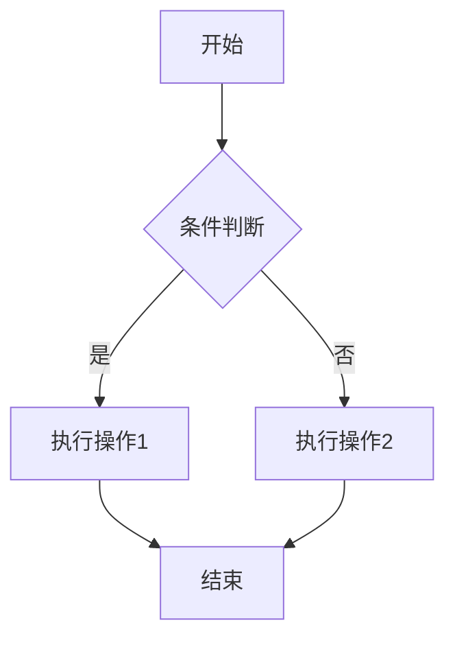
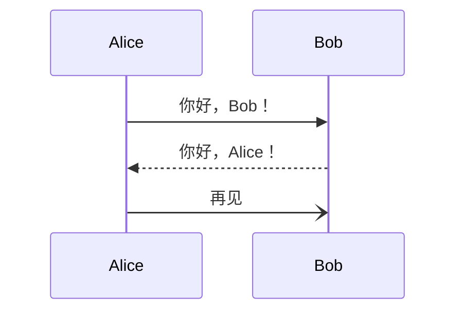
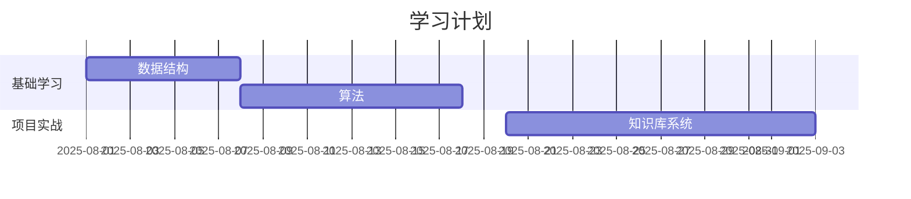
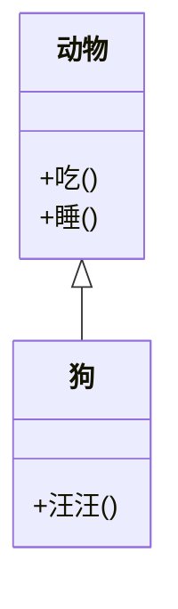
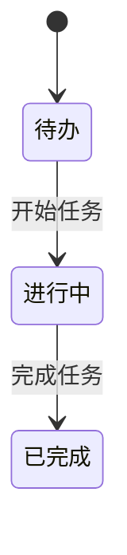
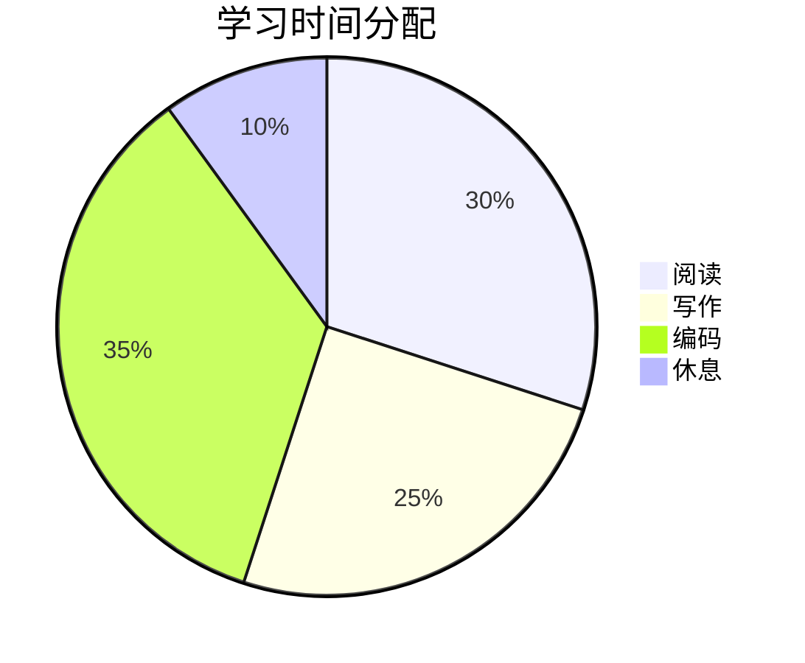
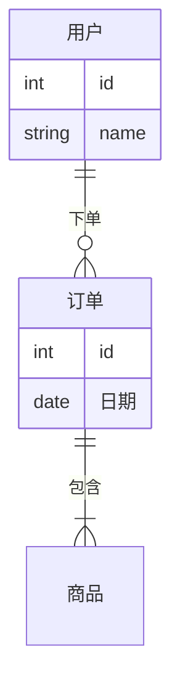

# 老马公开的知识库

github: [https://github.com/houbb/lmxxf-thinking](https://github.com/houbb/lmxxf-thinking)

gitHub-pags: [https://houbb.github.io/lmxxf-thinking/](https://houbb.github.io/lmxxf-thinking/)

gitbook: [https://houbb.gitbook.io/digit-garden/](https://houbb.gitbook.io/digit-garden/)

# 前言

我们来介绍一下 Mermaid 图表。这是在 Markdown 笔记、知识库、文档里非常常用的一种“文本化绘图工具”。

## 一、Mermaid 是什么？

Mermaid 是一个用 纯文本语法 来绘制图表的开源工具。

* 你只需要写一段简单的 Markdown 代码块，不用鼠标拖拽，也不用复杂的 UI，就能生成 流程图、时序图、甘特图、思维导图 等可视化图表。
* 非常适合写文档、知识库、技术笔记，尤其和 Obsidian / VuePress / GitBook / Notion / GitHub 结合时，几乎无缝嵌入。

一句话总结：
👉 Mermaid = Markdown + 图表语法 = 即时可视化。

---

## 二、Mermaid 常见图表类型

### 1. 流程图 (Flowchart)

用于描述逻辑流程、算法步骤。

```
flowchart TD
    A[开始] --> B{条件判断}
    B -->|是| C[执行操作1]
    B -->|否| D[执行操作2]
    C --> E[结束]
    D --> E[结束]
```

效果



### 2. 时序图 (Sequence Diagram)

用于表示 消息传递、系统交互（比如微服务、前后端通信）。

```
sequenceDiagram
    Alice->>Bob: 你好，Bob！
    Bob-->>Alice: 你好，Alice！
    Alice-)Bob: 再见
```

效果




### 3. 甘特图 (Gantt Chart)

用于任务管理、项目排期。

```
gantt
    title 学习计划
    dateFormat  YYYY-MM-DD
    section 基础学习
    数据结构   :a1, 2025-08-01, 7d
    算法       :after a1, 10d
    section 项目实战
    知识库系统 :2025-08-20, 14d
```

效果



### 4. 类图 (Class Diagram)

常用于 面向对象建模

```
classDiagram
    class 动物 {
        +吃()
        +睡()
    }
    class 狗 {
        +汪汪()
    }
    动物 <|-- 狗
```

效果




### 5. 状态图 (State Diagram)

用于 状态机、任务流转。

```
stateDiagram-v2
    [*] --> 待办
    待办 --> 进行中 : 开始任务
    进行中 --> 已完成 : 完成任务
```

效果



### 6. 饼图 (Pie Chart)

快速展示比例结构

```
pie title 学习时间分配
    "阅读" : 30
    "写作" : 25
    "编码" : 35
    "休息" : 10
```

效果



### 7. ER 图 (Entity Relationship Diagram)

用于数据库建模

```
erDiagram
    用户 ||--o{ 订单 : 下单
    订单 ||--|{ 商品 : 包含
    用户 {
        int id
        string name
    }
    订单 {
        int id
        date 日期
    }
```

效果



## 三、使用场景
1. 知识笔记  
   在 Obsidian 里写算法/学习笔记，直接画流程图和时序图。  
2. 项目文档  
   在 GitHub 的 README 或 Wiki 中，直接插入架构图。  
3. 工作管理  
   用甘特图、状态图追踪任务进度。  
4. 学习总结  
   用思维导图/流程图整理知识体系。  

---

## 四、优点
- 轻量化：直接写在 Markdown 里，不需要额外的软件。  
- 可版本控制：文本可直接存进 Git，适合团队协作。  
- 动态更新：修改几行文字即可重绘图表，远比拖拽工具高效。  
- 开源生态：大部分知识库工具、文档框架都原生支持。  

---

## 五、典型用法（Obsidian / VuePress / GitHub）
- Obsidian：直接写 mermaid 代码块，就能即时渲染。  
- VuePress / GitBook：通过插件或内置支持，文档里展示动态图表。  
- GitHub：2022 年后，GitHub Markdown 已经原生支持 Mermaid，可以直接在 issue / PR / README 里画图。  

---

📌 总结一句：  
Mermaid = 把图表当代码写，它的核心价值就是：  
- 快速  
- 可维护  
- 可嵌入  
非常适合技术文档、知识库和数字花园。  

