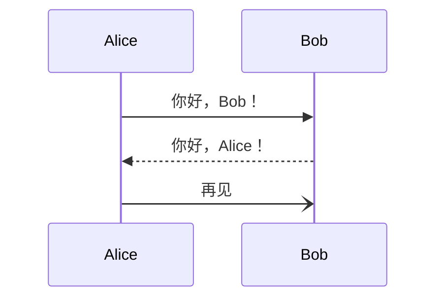
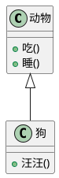

# 老马公开的知识库

github: [https://github.com/houbb/lmxxf-thinking](https://github.com/houbb/lmxxf-thinking)

gitHub-pags: [https://houbb.github.io/lmxxf-thinking/](https://houbb.github.io/lmxxf-thinking/)

gitbook: [https://houbb.gitbook.io/digit-garden/](https://houbb.gitbook.io/digit-garden/)

# markdown-chart 插件

为你的 VuePress 站点添加强大的图表功能。

此插件提供了 6 种不同的图表库，帮助你在 Markdown 文件中插入图表：

## 简单介绍

Chart.js：一个轻量级、易于使用、高度可定制的图表库。

与 ECharts 相比，Chart.js 更轻量。

ECharts：一个强大的、交互式的浏览器图表和可视化库。

与 Chart.js 相比，ECharts 更强大。

Flowchart：一个简单的 Markdown 扩展，用于生成流程图和序列图。

轻量级，只专注于流程图。

Markmap：从 Markdown 创建思维导图。

运行时较重，不建议在生产环境中使用。

Mermaid：以类似 Markdown 的方式从文本生成图表和流程图。

常用图表的强大集合。

PlantUML：由 Java 驱动的 UML 图表。

无客户端运行时，极其轻量。

# 安装使用

## 安装插件

VuePress 官方没有直接支持所有图表的原生渲染，需要安装插件。推荐使用：

```bash
npm install vuepress-plugin-md-enhance -D
```

> 这个插件支持 Chart.js、ECharts、Flowchart、Markmap、Mermaid、PlantUML 等多种图表。

在 `.vuepress/config.js` 中配置：

```js
import { mdEnhance } from "vuepress-plugin-md-enhance";

export default {
  plugins: [
    mdEnhance({
      chart: true,       // Chart.js
      echarts: true,     // ECharts
      flowchart: true,   // Flowchart
      markmap: true,     // Markmap
      mermaid: true,     // Mermaid
      plantuml: true,    // PlantUML
    }),
  ],
};
```


# 例子

为了更好的对比，我们按照如下的方式，每一个图表给出一个经典的例子。


比如：flowchart

```
flowchart TD
    A[开始] --> B{判断条件}
    B -->|是| C[执行操作1]
    B -->|否| D[执行操作2]
    C --> E[结束]
    D --> E[结束]
```

效果

```flowchart
flowchart TD
    A[开始] --> B{判断条件}
    B -->|是| C[执行操作1]
    B -->|否| D[执行操作2]
    C --> E[结束]
    D --> E[结束]
```

给出 6 个图表类型的经典例子，包含 Markdown 写法和渲染效果，方便对比。

## 1️⃣ Flowchart（流程图）

Markdown 写法：

```flowchart
flowchart TD
    A[开始] --> B{判断条件}
    B -->|是| C[执行操作1]
    B -->|否| D[执行操作2]
    C --> E[结束]
    D --> E[结束]
```

效果：

```flowchart
flowchart TD
    A[开始] --> B{判断条件}
    B -->|是| C[执行操作1]
    B -->|否| D[执行操作2]
    C --> E[结束]
    D --> E[结束]
```

---

## 2️⃣ Mermaid（综合图表示例）

Markdown 写法：

```
sequenceDiagram
    participant Alice
    participant Bob
    Alice->>Bob: 你好，Bob！
    Bob-->>Alice: 你好，Alice！
    Alice-)Bob: 再见
```

效果：



---

## 3️⃣ ECharts（柱状图示例）

Markdown 写法：

```
{
  tooltip: {},
  legend: { data: ['销量'] },
  xAxis: { data: ["衬衫","羊毛衫","雪纺衫","裤子","高跟鞋","袜子"] },
  yAxis: {},
  series: [
    { name: '销量', type: 'bar', data: [5, 20, 36, 10, 10, 20] }
  ]
}
```

效果：

```echarts
{
  tooltip: {},
  legend: { data: ['销量'] },
  xAxis: { data: ["衬衫","羊毛衫","雪纺衫","裤子","高跟鞋","袜子"] },
  yAxis: {},
  series: [
    { name: '销量', type: 'bar', data: [5, 20, 36, 10, 10, 20] }
  ]
}
```

---

## 4️⃣ Chart.js（折线图示例）

Markdown 写法：

```
{
  type: 'line',
  data: {
    labels: ['一月','二月','三月','四月','五月'],
    datasets: [{
      label: '温度',
      data: [0, 10, 5, 2, 20],
      borderColor: 'rgba(75,192,192,1)',
      fill: false
    }]
  }
}
```

效果：

```chart
{
  type: 'line',
  data: {
    labels: ['一月','二月','三月','四月','五月'],
    datasets: [{
      label: '温度',
      data: [0, 10, 5, 2, 20],
      borderColor: 'rgba(75,192,192,1)',
      fill: false
    }]
  }
}
```

---

## 5️⃣ Markmap（思维导图示例）

Markdown 写法：

```
# 我的知识体系
## 编程
- Python
- JavaScript
- Java
## 数据库
- MySQL
- MongoDB
## 工具
- Git
- Obsidian
```

效果：

```markmap
# 我的知识体系
## 编程
- Python
- JavaScript
- Java
## 数据库
- MySQL
- MongoDB
## 工具
- Git
- Obsidian
```

---

## 6️⃣ PlantUML（类图示例）

Markdown 写法：

```
@startuml
class 动物 {
  +吃()
  +睡()
}
class 狗 {
  +汪汪()
}
动物 <|-- 狗
@enduml
```

效果：




